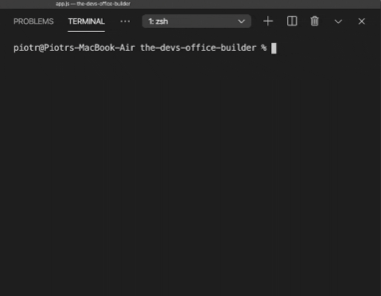
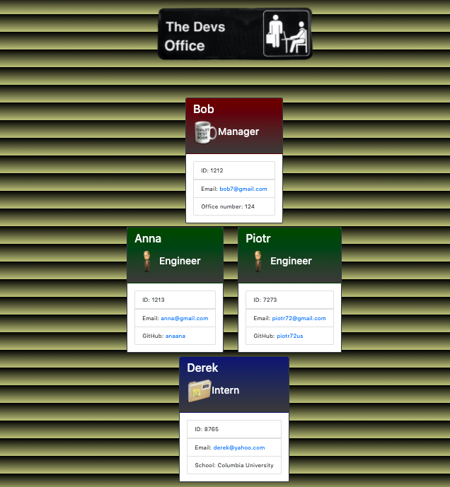

# :office: :dvd: :coffee: The Devs Office Builder :office: :dvd: :coffee:

## Description
This is a smart command line application to help you generate a website featuring a software enginneering team chart via node.js and command line. If you want to show off your web development team to the online world, this is an app for you. The Manager, Engineer/s, and Intern/s will all have their personal info and contact details displayed on individual cards.

## Table of Contents
* [Installation](#Installation)
* [Usage](#Usage)
* [License](#License)
* [Contributing](#Contributing)
* [Test](#Test)
* [Questions](#Questions)

## Installation

Download (clone) this repository from github and open it in Visual Studio Code on your machine. Make sure to install the inquirer dependency by typing `npm install inquirer` in your terminal. Finally, type `node app.js` to initiate __The Devs Office Builder!__

## Usage
Follow the prompts displayed in your terminal by the inquirer. First, enter your Manager's contact details. Then, choose how many (if any) Engineers and Interns you would like to add to your team. Enter each of their details and decide if you want to add another role or if you are ready to build your team. Each employee has their name, role, ID, and email displayed on their card. In addition, the Manager has the office number, the Engineer has the github profile, and the Intern has the school name. When you are done answering all the questions, your input will be conveniently displayed on a brand new html page and saved in an output folder inside your local repository. Look at the screenshots to find out more. Good luck!

## License
This application is covered under the MIT license.

## Contributing
If you would like to contribute to this project, please contact me at the email address below.

## Test
Testing framework used: coming soon!

## Questions
If you have additional questions, you can reach me via my GitHub profile: [peterdudek](https://github.com/peterdudek) 
or send me an email at: piotr72@gmail.com
